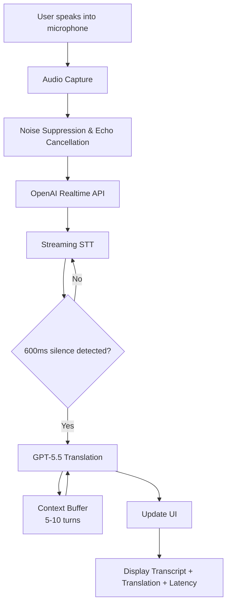

# Live AI Interpreter — Product Requirements Document (MVP)

| Field | Value |
|-------|-------|
| **Product** | Live AI Interpreter |
| **Version** | MVP 1.0 |
| **Status** | Draft |
| **Last Updated** | August 1, 2026 |
| **Target Platform** | Desktop (Electron) |

---

## 1. Executive Summary

Live AI Interpreter is a desktop-first application that performs **real-time bidirectional translation** between **Australian English** and **Natural Hindi**. The product listens to spoken input via the microphone, transcribes speech in real time, detects sentence boundaries, and displays a natural, context-aware translation within **1–2 seconds** after the speaker finishes a sentence.

The MVP prioritizes speed, translation quality, and a minimal, distraction-free user experience over feature breadth.

---

## 2. Problem Statement

Communicating across Australian English and Hindi in live settings—meetings, calls, family conversations, or customer interactions—currently requires either a human interpreter or slow, manual translation tools. Existing solutions often suffer from:

- High latency (3–5+ seconds per utterance)
- Unnatural or overly literal translations
- Poor handling of Australian English accents and idioms
- Cluttered interfaces that distract from the conversation
- Lack of context across multi-turn dialogue

Live AI Interpreter addresses these gaps with a focused, low-latency desktop experience powered by OpenAI's Realtime API and GPT-5.5.

---

## 3. Goals

| # | Goal | Description |
|---|------|-------------|
| G1 | Live voice-to-text translation | Continuous microphone input with streaming transcription and translation |
| G2 | Australian English ↔ Natural Hindi | Accurate recognition of Australian English; fluent, spoken-style Hindi output (and vice versa) |
| G3 | Sub-2s response time | Translation visible within 1–2 seconds after sentence completion |
| G4 | Context-aware translations | Maintain conversational context across the last 5–10 dialogue turns |
| G5 | Minimal, distraction-free UI | Clean interface focused on transcript and translation only |

---

## 4. Non-Goals (Out of Scope for MVP)

The following are explicitly **not** included in the MVP:

- Offline AI / on-device models
- OCR or image-based translation
- Multi-language support beyond Australian English and Hindi
- User authentication or accounts
- Conversation history sync across devices
- Text-to-speech output
- Mobile application (deferred to future release)

---

## 5. Target Users & Use Cases

### 5.1 Primary Users

- **Bilingual professionals** communicating with Hindi-speaking colleagues or clients in Australia
- **Family members** bridging language gaps in personal conversations
- **Support staff** assisting Hindi-speaking customers in real time

### 5.2 Core Use Cases

| ID | Use Case | Flow |
|----|----------|------|
| UC-1 | English → Hindi live translation | User speaks in Australian English; app displays Hindi translation |
| UC-2 | Hindi → English live translation | User speaks in Hindi; app displays Australian English translation |
| UC-3 | Copy translated text | User taps copy button to paste translation elsewhere |
| UC-4 | Monitor latency | User views latency indicator to assess real-time performance |
| UC-5 | Extended session | User runs the app continuously for 30+ minutes without degradation |

---

## 6. Functional Requirements

### 6.1 Audio Capture

| ID | Requirement | Priority |
|----|-------------|----------|
| FR-A1 | Capture continuous microphone audio stream | P0 |
| FR-A2 | Apply noise suppression to incoming audio | P0 |
| FR-A3 | Apply echo cancellation to incoming audio | P0 |
| FR-A4 | Handle microphone permission requests gracefully | P0 |

### 6.2 Speech Recognition (STT)

| ID | Requirement | Priority |
|----|-------------|----------|
| FR-S1 | Stream live transcription as the user speaks | P0 |
| FR-S2 | Support Australian English accent and vocabulary | P0 |
| FR-S3 | Support Hindi speech recognition | P0 |
| FR-S4 | Display original transcript in the UI in real time | P0 |

### 6.3 Sentence Detection

| ID | Requirement | Priority |
|----|-------------|----------|
| FR-D1 | Detect sentence completion based on speech pauses | P0 |
| FR-D2 | Trigger translation after approximately **600ms of silence** following an utterance | P0 |
| FR-D3 | Avoid premature translation on mid-sentence pauses where possible | P1 |

### 6.4 Translation

| ID | Requirement | Priority |
|----|-------------|----------|
| FR-T1 | Translate bidirectionally: Australian English ↔ Natural Hindi | P0 |
| FR-T2 | Preserve names, numbers, dates, and addresses without translation | P0 |
| FR-T3 | Use natural spoken language (not overly formal or literal) | P0 |
| FR-T4 | Maintain context from the last **5–10 dialogue turns** for coherent multi-turn translation | P0 |
| FR-T5 | Display translated text in the UI upon completion | P0 |

### 6.5 User Interface

| ID | Requirement | Priority |
|----|-------------|----------|
| FR-U1 | Display original transcript (source language) | P0 |
| FR-U2 | Display translated text (target language) | P0 |
| FR-U3 | Show a listening/recording indicator when actively capturing audio | P0 |
| FR-U4 | Provide a copy button for translated text | P0 |
| FR-U5 | Display latency (time from sentence end to translation displayed) | P1 |
| FR-U6 | Support dark mode | P1 |
| FR-U7 | Allow language direction toggle (English → Hindi / Hindi → English) | P0 |

### 6.6 Settings (Phase 4)

| ID | Requirement | Priority |
|----|-------------|----------|
| FR-C1 | Configure source and target languages (English/Hindi) | P1 |
| FR-C2 | Select microphone input device | P1 |
| FR-C3 | Configure OpenAI API key | P0 |

---

## 7. Non-Functional Requirements

### 7.1 Performance Targets

| Metric | Target | Measurement |
|--------|--------|-------------|
| Speech-to-text latency | < 400ms | Time from speech to transcript update |
| Translation latency | < 500ms | Time from sentence detection to translation ready |
| **Total end-to-end latency** | **< 2s** | Time from speaker finishing sentence to translation displayed |
| Application startup | < 3s | Cold start to ready state |
| Memory usage | < 500MB | Steady-state during active session |

### 7.2 Reliability

| Requirement | Target |
|-------------|--------|
| Transcription accuracy (quiet environment) | ≥ 95% |
| Stable continuous operation | 30+ minutes without crash or degradation |
| Graceful recovery from network interruptions | Auto-reconnect to OpenAI Realtime API |

### 7.3 Usability

- UI must be readable at a glance during live conversation
- No more than one primary action required to start interpreting
- Keyboard shortcuts for copy and language toggle (nice-to-have)

### 7.4 Security & Privacy

- API keys stored locally (not transmitted to third parties beyond OpenAI)
- No conversation data synced to cloud in MVP
- Microphone access requested only when needed

---

## 8. Technical Architecture

### 8.1 Tech Stack

| Component | Technology |
|-----------|------------|
| Desktop shell | Electron |
| Frontend | React + TypeScript |
| Backend | Node.js |
| AI / STT / Translation | OpenAI Realtime API + GPT-5.5 |
| State management | Zustand |
| Build tool | Vite |
| Packaging | Electron Builder |

### 8.2 System Flow

```text
Electron App
    │
React UI (Zustand state)
    │
Audio Stream (mic capture + noise suppression + echo cancellation)
    │
OpenAI Realtime API
    │
Speech Recognition (streaming STT)
    │
Sentence Detection (~600ms silence threshold)
    │
GPT-5.5 Translation (with 5–10 turn context window)
    │
Display Result (transcript + translation + latency)
```

### 8.3 Key Integration Points

| Integration | Purpose |
|-------------|---------|
| OpenAI Realtime API | Streaming speech recognition and low-latency audio processing |
| GPT-5.5 | Context-aware translation with dialogue history |
| Web Audio API / Electron media APIs | Microphone capture and audio preprocessing |
| Electron IPC | Communication between main and renderer processes |

### 8.4 Context Memory

- Maintain a rolling buffer of the last **5–10 dialogue turns** (source + translated pairs)
- Pass context to GPT-5.5 with each translation request
- Clear context on explicit user action or session reset

---

## 9. UI Specification

### 9.1 Layout (MVP)

```text
┌─────────────────────────────────────────────┐
│  Live AI Interpreter          [EN ↔ HI]  🌙 │
├─────────────────────────────────────────────┤
│                                             │
│  ┌─ Original ─────────────────────────────┐ │
│  │  [Live transcript appears here]        │ │
│  └────────────────────────────────────────┘ │
│                                             │
│  ┌─ Translation ──────────────────────────┐ │
│  │  [Translated text appears here]   [📋] │ │
│  └────────────────────────────────────────┘ │
│                                             │
│         ● Listening…          Latency: 1.2s │
└─────────────────────────────────────────────┘
```

### 9.2 UI States

| State | Visual Indicator |
|-------|------------------|
| Idle | Microphone icon, prompt to start |
| Listening | Pulsing indicator, live transcript updating |
| Translating | Brief loading state on translation panel |
| Error | Inline error message with retry option |
| Offline / API error | Connection status banner |

---

## 10. Milestones & Delivery Plan

### Phase 1 — Foundation
**Deliverables:**
- Electron + Vite + React + TypeScript project scaffold
- Basic React UI shell (transcript + translation panels)
- Microphone audio capture with permission handling

**Exit criteria:** App launches, captures audio, displays placeholder UI.

---

### Phase 2 — Speech Recognition
**Deliverables:**
- OpenAI Realtime API integration
- Streaming transcription for Australian English and Hindi
- Live transcript display in UI

**Exit criteria:** Spoken input appears as live text with < 400ms perceived latency.

---

### Phase 3 — Translation & Intelligence
**Deliverables:**
- Sentence detection (~600ms silence trigger)
- GPT-5.5 translation pipeline (English ↔ Hindi)
- Context memory (5–10 turn window)
- Entity preservation (names, numbers, dates, addresses)

**Exit criteria:** Full end-to-end flow with < 2s total latency in quiet environment.

---

### Phase 4 — Polish & Ship
**Deliverables:**
- Settings panel (language, mic, API key)
- Latency display
- Dark mode
- Performance optimization (memory, startup time)
- Electron Builder packaging for macOS / Windows / Linux

**Exit criteria:** All success criteria met; installable desktop build produced.

---

## 11. Success Criteria

| # | Criterion | Measurement |
|---|-----------|-------------|
| SC-1 | Translation appears within **1–2 seconds** of sentence completion | Automated latency logging + manual QA |
| SC-2 | ≥ **95% transcription accuracy** in quiet environments | Sample test set of 50 utterances per language |
| SC-3 | Translations read as **natural conversational language** | Qualitative review by bilingual reviewers |
| SC-4 | Stable operation for **30+ minutes** | Soak test without crash or memory leak |
| SC-5 | Startup in **< 3 seconds** | Cold start benchmark on target hardware |
| SC-6 | Memory usage **< 500MB** during active session | Process monitor during 30-min session |

---

## 12. Dependencies & Risks

### 12.1 Dependencies

| Dependency | Impact |
|------------|--------|
| OpenAI Realtime API availability and pricing | Core functionality |
| OpenAI GPT-5.5 model access | Translation quality |
| Stable internet connection | Required for all AI features |
| User-provided OpenAI API key | Required for MVP (no auth system) |

### 12.2 Risks

| Risk | Likelihood | Mitigation |
|------|------------|------------|
| Latency exceeds 2s target | Medium | Optimize pipeline; tune silence threshold; cache context efficiently |
| Poor accuracy with Australian accent | Medium | Test early with diverse accent samples; tune Realtime API config |
| API rate limits or cost | Medium | Implement backoff; display usage guidance in settings |
| Microphone quality varies by device | High | Document hardware recommendations; expose mic selection in settings |
| Mid-sentence pause triggers early translation | Medium | Tune silence detection; consider partial utterance buffering |

---

## 13. Future Enhancements (Post-MVP)

| Enhancement | Description |
|-------------|-------------|
| Medical / legal glossary | Domain-specific term handling for professional use |
| Text-to-speech | Speak translated output aloud |
| Always-on-top overlay | Floating window for use alongside other apps |
| Mobile app | iOS and Android clients |
| Offline mode | On-device models for privacy-sensitive scenarios |
| Deepgram integration | Alternative STT provider for cost or accuracy optimization |
| Conversation export | Save and export session transcripts |
| Multi-language expansion | Support additional language pairs |

---

## 14. Open Questions

| # | Question | Owner | Status |
|---|----------|-------|--------|
| OQ-1 | Should language direction auto-detect or require manual toggle? | Product | Open |
| OQ-2 | What is the maximum session length before context window reset? | Engineering | Open |
| OQ-3 | macOS-only for MVP or cross-platform from day one? | Product | Open |
| OQ-4 | How should API key entry be secured (OS keychain vs. local config)? | Engineering | Open |
| OQ-5 | Should partial/in-progress translations be shown before sentence completion? | Product | Open |

---

## 15. Appendix

### A. Glossary

| Term | Definition |
|------|------------|
| STT | Speech-to-Text |
| Realtime API | OpenAI's low-latency streaming audio API |
| Sentence detection | Logic that determines when a speaker has finished an utterance |
| Context window | Rolling history of recent dialogue turns passed to the translation model |
| Australian English | English as spoken in Australia, including accent and regional vocabulary |

### B. Reference Architecture Diagram



---

*End of document*
